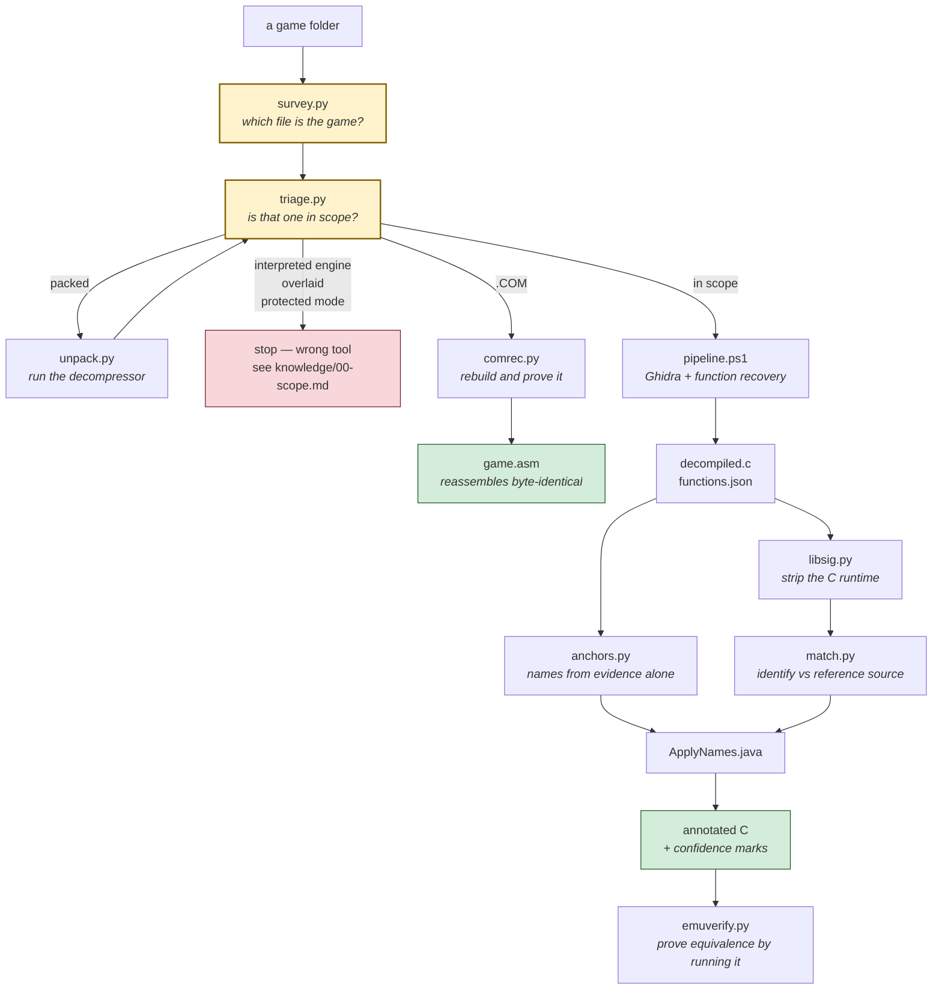
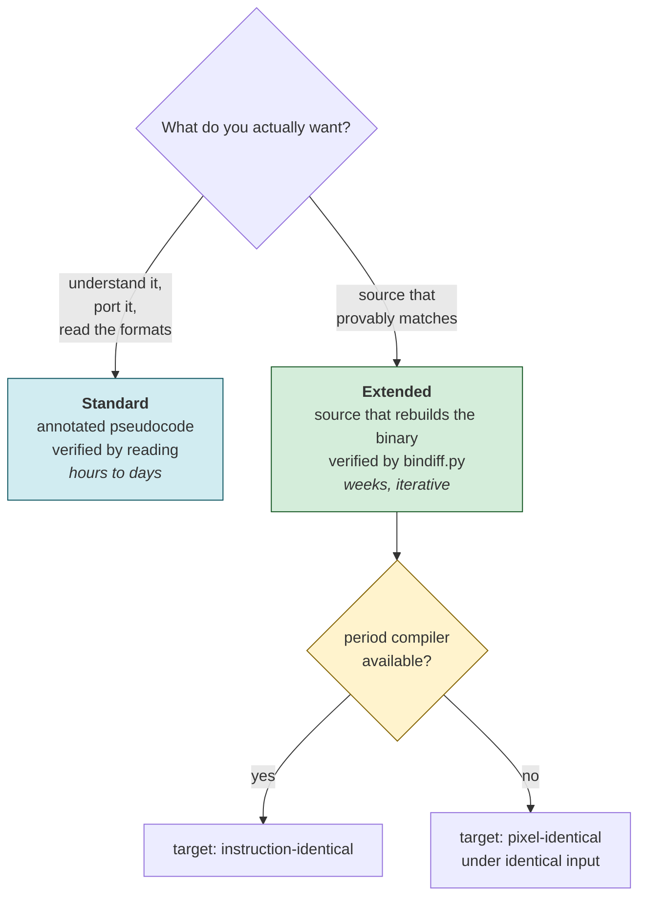
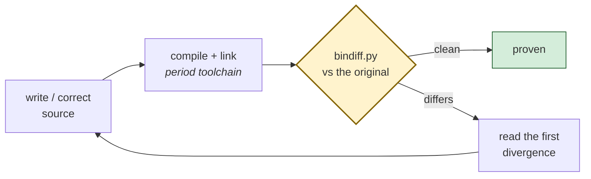

# dos-decompiler

Tooling for reverse-engineering 1980s DOS programs — 16-bit real-mode MZ
executables for the 8086/8088 — with every accuracy claim measured against a
linker map used as an answer key.

These are **command-line programs** — Python and PowerShell, no AI involved in
running them. They parse MZ headers, emulate 8086 code, compute masked byte
signatures, and diff instruction streams: work that has to be done by code
because no amount of reasoning substitutes for executing 466,000 instructions.

They wrap Ghidra rather than replacing it, adding the parts Ghidra does not do
for this era: finding the functions its analysis misses, recognising the C
runtime so it stops polluting the results, identifying functions against
reference source, unpacking compressed executables, and deciding equivalence by
actually executing candidates.

The repository also carries a **method** — `AGENTS.md` and `knowledge/` —
because the tools produce evidence and someone still has to judge it. That part
is written for a coding agent to follow, but it is equally a manual for a
person. Delete the documents and you still have a working toolkit; delete the
tools and you have an essay.

Start with the [worked example](#worked-example-start-to-finish).

---

## Why bother with 40-year-old games

This exists to **learn from them**, not to pirate or repackage them.

A 1984 game had 64 KB of addressable data, no floating point worth using, a
processor measured in single-digit megahertz, and a display with four colours.
Every technique in such a program is there because it had to be. That makes
these binaries unusually good teaching material: the constraints are visible in
the code, and the reasoning behind each decision is recoverable.

Some of what came out of the one program this toolkit was validated against:

- **A drawing primitive that is also a collision test.** Sopwith draws sprites
  by XOR-ing them into CGA memory. XOR again and the sprite erases itself,
  restoring what was underneath — no backing store needed. And the value read
  back tells you whether something was already there, so the same operation
  detects collisions. One mechanism doing three jobs.
- **Trigonometry without floating point.** A 16-entry sine table of integers
  scaled by 256, indexed by angle. Cosine is the same table read at an offset.
  Multiply, then shift right by 8.
- **Polymorphism in C, in 1984.** Every game object carries `ob_movef` and
  `ob_drawf` — function pointers. The main loop walks a list and calls through
  them, which is a vtable written by hand a decade before anyone called it that.
  It is also why a decompiler cannot find those functions: nothing *calls* them
  by name.
- **A program that brought its own runtime.** The shipped binary shares not one
  byte of startup code with the compiler its own makefile names. The author
  replaced the C library rather than pay for what he did not use.
- **Data as landmarks.** Four of its source files contain no code at all — 60 KB
  of sprite bitmaps, terrain, and level configuration.

The same is true of the craft on this side of the problem. Working out *why*
Ghidra misses a third of the functions teaches more about linkers, calling
conventions and memory models than any tutorial, because the answer has to be
right — a linker map is checking your work.

Everything here is tooling and documentation. **No game code, no compiler code,
and no copyrighted binaries are distributed**; the signature databases are
masked byte fingerprints used for identification, and `tests/sopwith/` contains
build recipes that point at Sopwith's own GPL source rather than including it.

---

## The pipeline



**Survey and triage first, always.** A DOS release is rarely one file — one 1988
folder held five executables, and only its batch file distinguished the game
from the setup stub and two logo players. And several common kinds of DOS game
fall outside this toolkit entirely; one of them, interpreted engines, fails
*silently*: decompiling gets you a correct rendering of a virtual machine and
none of the game.

Nothing needs to live beside the game. Every tool takes paths, so the toolkit
can sit anywhere — see [Using this with an agent](#using-this-with-an-agent)
for the one case where location matters.

---

## What it handles

| Program shape | Verdict |
|---|---|
| MZ, C-compiled, small memory model | **works** — the validated case |
| MZ, C-compiled, medium model | mostly |
| MZ, C-compiled, compact/large/huge | partly; emulation assumes small model |
| MZ, hand-written assembly | partly; no C runtime to strip, no C source to match |
| Packed with Microsoft EXEPACK | **yes** — `unpack.py`, validated end to end |
| Packed with PKLITE | image recovered and verified; entry point not |
| Packed with LZEXE / DIET | untested; same mechanism should apply |
| Turbo / Borland Pascal | poorly; different convention, no signature database |
| Overlaid programs | no |
| `.COM` files | **yes, by a separate route** — `comrec.py` rebuilds them byte-for-byte, but gives assembly rather than C |
| DOS extenders, protected mode | no |
| Interpreted engines — SCI, SCUMM, AGI, DAAD | **wrong tool entirely** |

Full reasoning, and which failures are loud versus silent, in
[`knowledge/00-scope.md`](knowledge/00-scope.md).

---

## Measured results

Validated on **Sopwith** (1984), whose original source survives, rebuilt with
the compiler its own makefile names so the ground truth is period-correct:

| Stage | Result |
|---|---|
| Ghidra decompiles 16-bit real mode | 289 of 289 functions, 0 failures |
| Function entry points, auto-analysis alone | 99 of 148 known (67%) |
| After `RecoverFunctions.java` | **120 of 148 (81%)** |
| C runtime detection | **precision 1.000**, recall 0.76–0.91 |
| Function identification | **precision 0.935**, recall 0.717 |
| Equivalence by emulation | **110 matches, precision 1.000** |

> **Scope note.** One program, small model, ~200 functions, no overlays, no
> packing. These are calibration for a program of that shape, not universal
> constants.

And on **ParaTrooper** (1982), a 16 KB `.COM` file, via the separate `.COM`
route:

| Stage | Result |
|---|---|
| Rebuild | **byte-identical**, SHA-256 checked outside the tool |
| Layout — the CS-reloading entry stub | detected, no manual flags |
| Instructions recovered, code region | **87.7%** (4,674 of 5,328 bytes) |
| Pinned to fixed bytes | 236 of 2,017, all encoding-form alternates |

Written up in [`tests/com/CASE-STUDY.md`](tests/com/CASE-STUDY.md), including
the four bugs the attempt exposed.

### What this does *not* give you

**Source resembling the original.** The compiler destroyed the names in 1987 and
they are not in the file; no decompiler can recover what was never stored.

```c
/* original source */              /* what comes back */
scorepln( ob )                     void __cdecl16near FUN_1000_5056(undefined2 param_1)
OBJECTS *ob;                       {
{                                    FUN_1000_4ff1(param_1,0x32);
    scoretarg( ob, 50 );             return;
}                                  }
```

Control flow: essentially perfect. Names, types, structs, comments, macros:
gone. The identification figures above are about knowing *which function is
which*, not about the C looking like the C that was written.

If you want source that provably matches, that is the
[extended workflow](#two-workflows) — reconstruction, not decompilation.

---

## Two workflows

Ask which one is wanted **before starting**. They are different projects.



### The extended loop



`bindiff.py` compares **instructions**, not bytes, resolving branch targets
through the symbol table so a different layout is not reported as a difference.
The count of instruction-identical functions is the progress bar, and it has
the property that matters: it cannot be talked up.

Details in [`knowledge/07-extended-reconstruction.md`](knowledge/07-extended-reconstruction.md).

### The verification ladder

Every claim about a reconstruction sits on one of these rungs. Know which, and
say so.

| Rung | Oracle | Proves |
|---|---|---|
| 1 | byte-identical rebuild | the source is right |
| 2 | instruction-identical, layout-tolerant — `bindiff.py` | the code is right |
| 3 | per-function behavioural equivalence — `emuverify.py` | this function is that function |
| 4 | pixel-identical frames under identical input | the program behaves the same |
| 5 | "looks right" | **nothing** |

For MZ executables, rung 1 is the goal of a long reconstruction loop. For
`.COM` files it is where you start — see below.

---

## The .COM route

A `.COM` file has no header, no relocations, and no difference between what is
on disk and what is in memory. The whole MZ pipeline is beside the point, and
what replaces it is stronger.

```powershell
python tools\comrec.py GAME.COM --out src\game.asm
```

`comrec.py` disassembles, emits NASM source covering every byte, reassembles
it, and compares the result to the original. It repeats until the rebuild
matches exactly, then writes the file. It prints `BYTE-IDENTICAL` or it prints
why not — there is no third answer, and nothing to interpret.

```
segments    : 0x0000+ @ base 0x0100, 0x2B40+ @ base 0x0000   (detected from the entry stub)
instructions: 2,017 disassembled (236 pinned to fixed bytes to preserve encoding)
bytes as code: 4,686 / 16,400  (28.6% of file)
code region : 0x2B40..0x4010  (5,328 bytes)
  recovered : 4,674 bytes as instructions (87.7% of the code region)
  data head : 0x0000..0x2B40 left as data (11,072 bytes)

BYTE-IDENTICAL. wrote src\paratrooper.asm
```

Two things to understand before quoting a number from that:

**It gives assembly, not C.** Many `.COM` games were written in assembly to
begin with — ParaTrooper has not one stack-frame prologue in 16 KB — so there
is no C behind the file to recover. Check before promising any.

**The whole-file percentage describes the game, not the recovery.** These
programs are mostly sprites and lookup tables. 28.6% of ParaTrooper came back
as code; 87.7% of the region that actually holds code did.

The output is meant to be read, not just assembled. Strings come back as text,
and every data row carries both its file offset and the address the code uses
to reach it:

```nasm
L_02B5C:
    mov si, 0x19f6
L_02B5F:
    cld
    lodsb
    cmp al, 0
    je L_02B6D
    mov ah, 0xe
    int 0x10
    jmp L_02B5F
...
    db 0x00, 0x0D, 0x0A                                    ; 0x01A05  ds:0x19F5
    db 'Do you have the Color/Graphics'                    ; 0x01A08  ds:0x19F8
```

Details and traps in
[`knowledge/08-com-reconstruction.md`](knowledge/08-com-reconstruction.md).

---

## Setup

Nothing is bundled. Copy the example environment file, point it at your own
copies, and source it.

```powershell
git clone <this repo>
cd dos-decompiler
Copy-Item env.example.ps1 env.ps1     # then edit the paths
. .\env.ps1
```

| Tool | Why | Variable | Required |
|---|---|---|---|
| [Ghidra](https://ghidra-sre.org/) 12.x | the decompiler; the only free one handling `x86:LE:16:Real Mode` | `GHIDRA_HOME` | yes |
| JDK 21+ | Ghidra needs it | `JAVA_HOME` | yes |
| Python 3 + `capstone`, `unicorn` | everything in `tools/` | on `PATH` | yes |
| [Open Watcom V2](https://github.com/open-watcom/open-watcom-v2) | rebuilding source; `wasm` for assembly | `WATCOM` | for ground truth |
| Microsoft C 5.0 | period-correct ground truth | `MSC_HOME` | optional |
| [DOSBox-X](https://dosbox-x.com/) | running period toolchains and the games | `DOSBOX` | optional |
| [radare2](https://rada.re/) | second opinion when Ghidra looks wrong | `RADARE2` | optional |

```bash
pip install capstone unicorn
```

Two install notes worth knowing:

- The Open Watcom **Windows installer crashes** and leaves a tree without the
  16-bit compiler. Use the `ow-snapshot.tar.xz` release asset instead.
- Period toolchains are archived as raw floppy images. `tools/fatextract.py`
  unpacks them; pooling everything by extension into `BIN/`, `LIB/` and
  `INCLUDE/` is enough to make them work.

---

## Worked example: start to finish

Real output, from Sopwith (1984). The point of this section is the **handoff**:
where the programs stop and judgement has to take over.

### 1. You run: what am I actually looking at?

Given a folder rather than a single file, survey it first — a DOS release is
rarely one executable.

```console
$ python tools/survey.py games/sopwith

Directory : games/sopwith
Files     : 8 in 2 directories
Subfolders: sopwith

-- Executables ----------------------------------------------------
  UNZIP.EXE                      131,400  out of scope
      blocker: packed with UPX
  sopwith\SOPWITH.EXE             60,928  in scope <== likely the game
      small model, 4.1 prologues/KB

  Chosen: sopwith\SOPWITH.EXE - named by a batch file
```

It walks subfolders, triages every executable it finds, and reads batch files
for the real entry point. Picking the wrong executable is easy and expensive:
a setup program decompiles just as willingly as the game.

### 2. You run: is that one in scope?

```console
$ python tools/triage.py games/sopwith/SOPWITH.EXE

File   : games/SOPWITH.EXE
Format : MZ
Image  : 60,407 bytes, 2 relocations
Entry  : 0000:8B46

[INFO   ] memory model looks small
           2 relocations, all beside the entry point: the startup loading
           DGROUP and the stack, nothing else needing a fixup

[INFO   ] compiled C likely (242 stack prologues, 4.1/KB)
           Dense frame setup is what a period C compiler emits.

VERDICT: in scope. Run tools/pipeline.ps1.
```

Had it said `BLOCKER`, you would stop here — or unpack first. No agent needed
for this step, and no agent should be trusted to skip it.

### 3. You run: decompile it

```console
$ ./tools/pipeline.ps1 -Exe games/SOPWITH.EXE -OutDir out

[1/4] Structure
[2/4] Import and analyse
    Using Language/Compiler: x86:LE:16:Real Mode:default
    Import succeeded
[3/4] Recover missed functions
    RecoverFunctions: 243 prologues seen, +34 from code pointers,
    10 over-long functions split, 325 functions total
[4/4] Decompile and fingerprint
    ExportDecompiledC: 324 decompiled, 1 failed -> out
```

```console
$ ls out
decompiled.c      311,070 bytes
functions.json    187,852 bytes
mzinfo.txt          2,445 bytes
```

### 4. The wall

`decompiled.c` is 311 KB of this:

```c
void __cdecl16near FUN_1000_0000(undefined2 param_1,undefined2 param_2)
{
  FUN_1000_2089(param_1,param_2);
  do {
    FUN_1000_02f6();  FUN_1000_3bef();  FUN_1000_0185();
    FUN_1000_3bd5();  FUN_1000_1886();
  } while( true );
}
```

324 functions, all named `FUN_1000_xxxx`. The control flow is correct and
complete. Nothing tells you what any of it *is*.

**This is where a program cannot help you and an agent can.** Deciding that the
function above is `main` — from its shape, an init call followed by an endless
loop — is judgement. So is deciding that a name is justified, and refusing to
give one when it is not.

### 5. You hand off to a coding agent

Open a session in the repository directory and paste:

> This repo is a DOS decompilation toolkit — read `AGENTS.md` and follow it.
>
> I have already run triage and the pipeline on `games/SOPWITH.EXE`; the output
> is in `out/`. Triage said: small memory model, compiled C, in scope.
>
> Continue from step 3 of the workflow. Specifically:
>
> 1. Run `anchors.py` and apply the names it justifies. Tell me how many were
>    corroborated by two independent kinds of evidence and how many stay
>    provisional.
> 2. Try each signature database in `signatures/` and tell me which compiler
>    built this, or that none matched and what that implies.
> 3. Find `main` by reading, not by rule — `anchors.py`'s guess was wrong on one
>    of two test binaries.
> 4. Work outward from `main` and give me an architecture summary: the main
>    loop's phases, how it draws, how it reads input.
>
> Mark every name as established or provisional. Do not guess names to make the
> output look more finished than it is.

### 6. What the agent does, and how you check it

It runs the remaining tools and reads the output. On this binary it will find:

```console
$ python tools/anchors.py out/functions.json --entry 1000:8b46 --names names.json
wrote names.json (20 evidence-based names, 2 corroborated by two or more
independent kinds of evidence; the rest stay provisional)
```

Two established, eighteen provisional — including `main`, whose automatic guess
is wrong here. That is the tooling refusing to sound confident, and it is what
you want.

**Check any claim it makes** by asking for the evidence:

> You named `FUN_1000_2089` as `swinit`. What is the evidence, and is it
> corroborated by more than one independent source?

If the answer is one source, the name is a hypothesis. `AGENTS.md` requires the
agent to say so.

### 7. If you want proof rather than a reading

Everything above is the **standard** workflow: readable output, verified by a
person. If you want source that provably matches the binary, that is the
[extended workflow](#two-workflows) — and the prompt is different:

> Use the extended workflow. Target rung 2 of the verification ladder: source
> that compiles to instruction-identical code, checked with `bindiff.py`. Report
> the count of identical functions after every iteration. Microsoft C 5.1 is at
> `C:\Applications\msc51`.

---

## Command reference

```powershell
# 0. What is in this folder, and which executable is the game?
python tools\survey.py path\to\game\folder

# 0a. Is that one in scope?
python tools\triage.py path\to\GAME.EXE

# 0b. If it says packed:
python tools\unpack.py path\to\GAME.EXE -o unpacked.exe
python tools\triage.py unpacked.exe

# 0c. If it is a .COM, stop here — a different and stronger route.
#     Rebuilds the file byte-for-byte and says so, or says why not.
python tools\comrec.py path\to\GAME.COM --out src\game.asm
nasm -f bin -o rebuilt.com src\game.asm      # then compare SHA-256 yourself

# 1. Structure, decompilation, function recovery
.\tools\pipeline.ps1 -Exe path\to\GAME.EXE -OutDir .\out

# 2. Names from evidence alone — no reference source needed
python tools\anchors.py out\functions.json --entry 1000:8b46 `
       --report out\anchors.txt --names out\names.json

# 3. Strip the C runtime so it stops competing for matches
python tools\libsig.py apply path\to\GAME.EXE out\functions.json `
       --db signatures\msc50-16bit-small.json --json out\lib.json

# 4. With reference source that genuinely corresponds to the binary
python tools\srcinv.py path\to\source --json src.json
python tools\match.py src.json out\functions.json --align `
       --exclude-library out\lib.json --report ident.md
```

Try each signature database in `signatures/` — the one that matches tells you
which compiler built the binary. If **none** match and you are confident of the
compiler, the program brought its own runtime, which is worth knowing early: it
means none of the binary can be dismissed as library noise.

---

## Using this with an agent

### Where everything goes

The toolkit does **not** need to sit beside the game — every tool takes paths.
What matters is where you start the agent, because that is how it finds the
instructions.

Here is the arrangement to copy. One folder per game you work on; the toolkit
cloned once and never edited.

```
C:\Projects\
│
├─ dos-decompiler\              <- the toolkit. Clone once. Don't edit.
│    tools\
│    knowledge\
│    AGENTS.md
│
└─ mygame\                      <- YOUR WORK FOLDER. Start the agent HERE.
     game\                      <- the original files, left untouched
       MYGAME.EXE
       MYGAME.DAT
     out\                       <- everything the tools produce
     AGENTS.md                  <- three lines, see below
```

On Linux or macOS the same shape, with `~/projects/` instead of `C:\Projects\`.

**Why a separate work folder?** The toolkit is a shared, read-only thing — you
will use it on several games. Your notes, decompiled output and reconstruction
attempts belong with the game, not mixed into the toolkit's git history.

### Setting it up, step by step

**Once, ever:**

```powershell
cd C:\Projects
git clone <this repo> dos-decompiler
cd dos-decompiler
Copy-Item env.example.ps1 env.ps1     # edit it to point at Ghidra, JDK, etc.
pip install capstone unicorn
```

**Once per game:**

```powershell
mkdir C:\Projects\mygame\game, C:\Projects\mygame\out
Copy-Item D:\wherever\the\game\* C:\Projects\mygame\game\ -Recurse
```

Then create `C:\Projects\mygame\AGENTS.md` containing exactly this:

```markdown
# Decompiling MYGAME

The DOS decompilation toolkit is at `C:\Projects\dos-decompiler`.
Read `C:\Projects\dos-decompiler\AGENTS.md` and follow it.

The game's original files are in `game/`. Write all output to `out/`.
Never modify anything in `game/`.
```

That file is what lets an agent started in `mygame\` find the method. It is
also a good place to record what you already know about the game.

### Starting the agent

**Claude Code** — install the toolkit as a user-level skill once, then it is
available in every project:

```powershell
Copy-Item -Recurse C:\Projects\dos-decompiler `
                   $HOME\.claude\skills\dos-decompile

cd C:\Projects\mygame
claude
```

Claude Code finds the skill by itself; `AGENTS.md` in the work folder tells it
where the game is.

**Codex, Kimi, Cursor, Aider and others that read `AGENTS.md`** — no install
step at all:

```powershell
cd C:\Projects\mygame
codex          # or whichever agent
```

They read `AGENTS.md` in the working directory, which points at the toolkit's
own `AGENTS.md`.

**Anything else** — start it in `C:\Projects\mygame` and paste:

> Read `C:\Projects\dos-decompiler\AGENTS.md` and follow it. The game is in
> `game/`; write output to `out/` and never modify `game/`. Start with
> `python C:\Projects\dos-decompiler\tools\survey.py game`.

### Running the tools by hand

The same paths, without an agent:

```powershell
cd C:\Projects\mygame
. C:\Projects\dos-decompiler\env.ps1

python C:\Projects\dos-decompiler\tools\survey.py game
python C:\Projects\dos-decompiler\tools\triage.py game\MYGAME.EXE
C:\Projects\dos-decompiler\tools\pipeline.ps1 -Exe game\MYGAME.EXE -OutDir out
```

If typing the full path grates, add the toolkit to `PATH` for the session:

```powershell
$env:PATH = "C:\Projects\dos-decompiler\tools;$env:PATH"
python survey.py game
```

### Entry points

Every tool is plain Python or PowerShell with `--help`, so any agent that can
run a shell can drive this. Two entry points:

| File | For |
|---|---|
| [`AGENTS.md`](AGENTS.md) | **any agent** — Codex, Kimi, Cursor, Continue, Aider, or a human |
| [`SKILL.md`](SKILL.md) | Claude Code, as an installable skill |

`SKILL.md` is a thin wrapper; the method lives in `AGENTS.md` so the two cannot
drift apart.

**Claude Code** — copy the repo into a project's skills directory:

```powershell
Copy-Item -Recurse . <your-project>\.claude\skills\dos-decompile
```

**Codex, Kimi, and others that read `AGENTS.md`** — clone the repo into or
beside your working directory. Most will pick it up on their own; if not, tell
them to read it.

**Anything else** — paste this at the start of the session:

> Read `AGENTS.md` in this repository and follow it. Run
> `python tools/triage.py <the exe>` before anything else and report its verdict
> to me before promising results.

### More prompts

The [worked example](#worked-example-start-to-finish) covers the main handoff.
These cover the other situations.

**You want the agent to do everything, including the terminal work:**

> I have a DOS game at `games/MYGAME.EXE`. This repo is a decompilation
> toolkit — read `AGENTS.md` and follow it from step 0. Run triage first and
> tell me the verdict before doing anything else. If it is out of scope, say so
> and stop rather than working around it.

**Packed executable:**

> `games/MYGAME.EXE` is PKLITE-packed. Unpack it with `tools/unpack.py`, verify
> the decompression actually worked by comparing string counts before and
> after, then triage the result.

**You have related source:**

> I have the Amiga source for this game in `ref/`. Decompile the DOS build and
> use `srcinv.py` + `match.py` to carry names across. Tell me the precision and
> recall you would expect given the score distribution, and flag it if nothing
> clears 0.7 — that would mean the reference does not correspond to this binary.

**Checking a claim:**

> You named `FUN_1000_2089` as `swinit`. What is the evidence, and is it
> corroborated by more than one independent source? If it is single-source, say
> so and mark it provisional.

### What to insist on

These are the failure modes that cost the most time, all observed:

1. **Triage before promising anything.** A packed file or an interpreted engine
   will decompile beautifully and tell you nothing.
2. **No name on one source of evidence.** A sibling project kept a table of 35
   retracted conclusions; the pattern was explicit — single-source conclusions
   almost always need correcting. `anchors.py` enforces this and marks
   uncorroborated names `__maybe`.
3. **"No result" is not "no fact."** A grep that finds nothing, an emulator that
   never reaches a path, a signature database that matches zero functions — each
   has an innocent explanation and a damning one. Ask which.
4. **Measure, do not reason, about tooling changes.** Three confident
   predictions in this repo's own history were contradicted by measurement:
   module segmentation made identification *worse*, iterative refinement changed
   nothing, and *more* emulator input vectors reduced matches.

---

## Layout

```
tools/
  survey.py                  what is in this game folder? run this first
  triage.py                  is this one executable in scope?
  unpack.py                  run a packer's decompressor and dump the result
  comrec.py                  rebuild a .COM as NASM source, byte-for-byte, and prove it
  gfxdump.py                 render a region as CGA graphics to a PNG, without running it
  placements.py              recover "draw sprite S at column C row R" from the code
  pipeline.ps1               one command: .EXE in, decompiled C out
  mzinfo.py                  MZ structure, segments, packer and overlay detection
  anchors.py                 identify functions from evidence, with no source
  libsig.py                  recognise C runtime functions and exclude them
  emuverify.py               decide equivalence by running both under emulation
  bindiff.py                 instruction-level diff of a rebuild vs the original
  srcinv.py                  inventory functions/globals in K&R C and MASM source
  match.py                   identify binary functions against reference source
  modcluster.py              recover module boundaries from the binary
  mapparse.py                linker MAP -> ground-truth address map
  fatextract.py              pull files out of raw FAT12 floppy images
  dosrun.ps1                 drive a period DOS toolchain headlessly under DOSBox-X
  ghidra_scripts/
    RecoverFunctions.java    find the functions Ghidra's analysis misses
    ExportDecompiledC.java   export decompiled C + per-function fingerprints
    ApplyNames.java          write recovered names back, with confidence marks
knowledge/
  00-scope.md                what this handles and what it does not
  01-dos-binaries.md         MZ format, memory models, segments, packers, hardware
  02-compiler-fingerprints.md identifying the compiler and exploiting it
  03-what-works.md           measured results, including what failed
  04-pitfalls.md             traps that cost real time, with fixes
  05-prior-art.md            other projects, and where this sits among them
  06-lessons-from-siblings.md corrections paid for by two sibling reconstructions
  07-extended-reconstruction.md the verified-reconstruction workflow
  08-com-reconstruction.md   the .COM route, which reaches byte-identity in one run
signatures/                  C runtime fingerprints: MS C 5.0, MS C 5.1, Watcom
tests/sopwith/               the validation fixture and full case study
tests/com/                   .COM fixtures, rebuilt byte-identically on every run
AGENTS.md                    the method, for any agent or human
SKILL.md                     Claude Code wrapper
env.example.ps1              copy to env.ps1, point at your own tool copies
```

---

## Verifying a change

Sopwith is the fixture, because its source survives and a rebuild comes with a
linker map that states exactly where every function is.

```powershell
.\tests\sopwith\build\build.ps1 -Source <sopwith-source> -Work work\build
.\tests\sopwith\build\build.ps1 -Source <sopwith-source> -Work work\variant -Variant
.\tools\pipeline.ps1 -Exe work\build\sopwith.exe -OutDir work\decomp
python tests\sopwith\regress.py --build-dir work\build --decompiled work\decomp `
       --source <sopwith-source> --variant-dir work\variant
```

```
function entry points: 120 of 148 known  (81%)
library detection: precision 1.0  recall 0.905
identification, inferred order  precision 0.875  recall 0.583
identification, known order     precision 0.897  recall 0.583
emulation matching: 110 matches, precision 1.0
PASS  all metrics at or above their floors
```

It fails if precision or recall drops below the recorded floors.
[`tests/sopwith/CASE-STUDY.md`](tests/sopwith/CASE-STUDY.md) walks the whole
method through that example, including the hypotheses that turned out wrong.

The `.COM` route has its own suite, which needs nothing but NASM:

```powershell
python tests\com\regress.py
```

```
  PASS  encodings    byte-identical, 69.7% as instructions
  PASS  farstub      byte-identical, 7.9% as instructions
  PASS  plain        byte-identical, 32.8% as instructions
```

Each fixture is reassembled and compared by SHA-256, so a regression cannot
pass by accident. They are written rather than taken from a real game — games
of the period are still under copyright — and two of the four bugs found while
building this route were caught by a fixture rather than by the game, because a
real binary only exercises the paths it happens to use.

---

## Prior art

Read [`knowledge/05-prior-art.md`](knowledge/05-prior-art.md) before investing
here. This overlaps with existing work, substantially in one case.

- **[mzretools](https://github.com/neuviemeporte/mzretools)** — same target, and
  its goal (instruction-level-identical reconstruction, verified by diffing) is
  the more rigorous one. If you want a faithful reconstruction rather than a
  readable one, start there.
- **[dis86](https://github.com/xorvoid/dis86)** — a better decompiler core
  within a narrower scope: SSA IR, semantically careful, flat binaries only.
- **[Spice86](https://github.com/OpenRakis/Spice86)** — dynamic instead of
  static. Emulates, builds a CFG from what actually executes, generates a
  runnable C# project you rewrite function by function. Reaches code static
  analysis cannot.

What is distinctive here: signature databases built from the actual period
compilers, equivalence decided by execution rather than scored, and every
accuracy claim measured with a regression harness that fails when a change
makes things worse.

---

## Licence

**GNU General Public License v3.0** — see [`LICENSE`](LICENSE).

Chosen deliberately rather than for convenience. This toolkit exists because
David L. Clark released Sopwith's source under the GPL in 2003, and that act is
the only reason any of its accuracy figures can be checked at all. Passing the
same terms on is the appropriate way to say thank you: anyone may use, study and
modify this, and anything built on it stays open for the next person trying to
learn from it.

The licence covers the tooling and documentation in this repository. It does not
and cannot cover the games you point it at, or the period compilers you supply —
those remain their owners'.

---

## Status

Working and measured, on **one** program. The extended workflow's tools are
validated with controls but have not yet been driven through a full
reconstruction. Known gaps are listed in
[`knowledge/00-scope.md`](knowledge/00-scope.md) rather than left for you to
discover.
