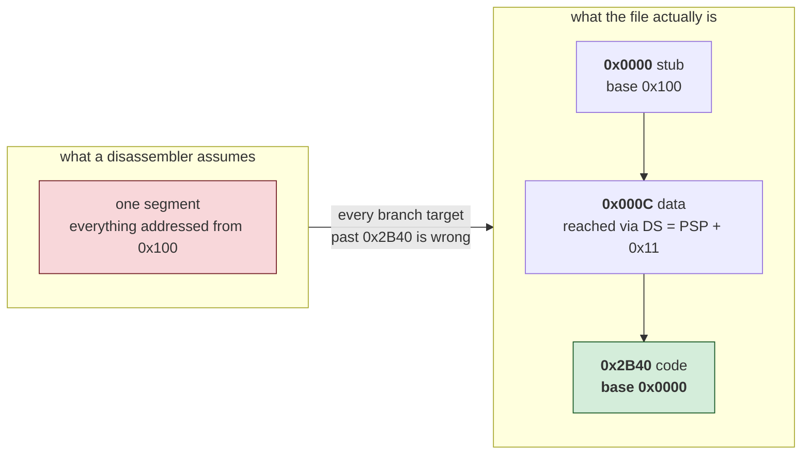

# 08 — Reconstructing a .COM exactly

An MZ executable is decompiled. A `.COM` file can be *reconstructed*: turned
back into assembly that rebuilds the original file byte for byte, with the
rebuild checked rather than assumed. That is rung 1 of the
[verification ladder](../README.md#the-verification-ladder), the only rung that
leaves nothing to argue about, and for `.COM` files it is reachable in a single
run.

The tool is `tools/comrec.py`. The rest of this page is why it works and where
it stops.

## Why .COM is the easy case

A `.COM` file has no header. The whole file is the image, DOS loads it at
offset `0x100` of a fresh segment, and execution starts at the first byte.
There are no relocations to apply, no segment table to interpret, no
distinction between what is on disk and what is in memory. Everything an MZ
loader has to reconstruct is simply absent.

That removes almost every source of doubt. What is left is one question asked
repeatedly: is this byte the start of an instruction, or is it data?

## The always-green loop

The tool never emits assembly it has not checked. Each round:

1. Walk the code by recursive descent from the known entry points.
2. Emit NASM source covering every byte — instructions where they were found,
   `db` everywhere else.
3. Assemble it, asking NASM for a *listing*.
4. Compare the bytes NASM emitted for each instruction against the bytes that
   were in the file at that offset.
5. Anything that disagrees is retried with a different spelling, and pinned to
   raw bytes if no spelling works.


The loop ends when the rebuilt file matches the original exactly. It cannot end
any other way, so the output is either right or absent.

Asking NASM for a listing is what makes step 4 possible. Comparing the finished
binary only reveals the *first* byte that differs, and a re-encoding shifts
everything after it, so a whole-file diff cannot name the instruction at fault
— it reports one failure and hides the other two hundred. The listing gives
per-line bytes, which turns "something is wrong somewhere" into an exact list
and collapses hundreds of rounds into a handful.

## Same instruction, different bytes

Most disagreements are not mistakes. An x86 instruction usually has several
legal encodings and NASM picks the shortest; a 1982 assembler often did not.

    05 11 00      add ax, 0x11      accumulator form, what the file holds
    83 C0 11      add ax, 0x11      what NASM emits

Both are correct. Only one matches. `strict word` suppresses NASM's optimiser
and recovers these as readable code — worth 42 instructions of the 223 that
initially failed on ParaTrooper.

Others cannot be recovered as text at all:

    8B D0         mov dx, ax        the file's encoding
    89 C2         mov dx, ax        NASM's, and no syntax selects the other

These differ in the direction bit, and NASM has no way to spell the
alternative. They are emitted as fixed bytes carrying their disassembly in a
comment:

    db 0x8B, 0xD0                          ; mov dx, ax

The reader loses nothing; the byte count does. Judge output by how much of it
is *disassembled*, not by how much is syntactically an instruction.

## Where recursive descent stops, and where it should

Recursive descent follows control flow, so it finds only what something jumps
to. Two failure modes matter, in opposite directions.

**Walking too far.** `mov ax, 0x4C00 / int 0x21` is how every DOS program
exits. Control does not come back, and what usually sits after it is the
message the program just printed. Walk on through and that text becomes
invented code — on a 48-byte test file the string `Hello from a plain COM
file$` disassembled into `insb / outsw / popaw`, which is perfectly valid, byte
identical, and meaningless. The walk stops at a terminating `int`.

**Not walking far enough.** Code reached only through a jump table or a
computed call is never queued, and stays behind as data. ParaTrooper hides
about a kilobyte that way, including a 779-byte block that opens with a plain
`jmp`.

The test for whether an unreferenced gap is code is that linear disassembly
lands *exactly* on its far end. Real code abuts the next known instruction;
arbitrary data almost never decodes into a whole number of instructions
finishing precisely on the boundary. Two guards keep it honest: a gap that is
mostly printable ASCII is left alone, because text decodes into valid
instructions and lands on boundaries just fine, and a gap containing
`insb`, `outsw`, `arpl` or `bound` is rejected, because a game does not use
them.

Every sweep is re-verified by the loop, so a wrong guess costs a round rather
than correctness.

## The trap: a .COM with two bases

A `.COM` is nominally one segment, but anything larger than a few kilobytes
often opens with a stub that reloads CS and continues at a fresh base.
ParaTrooper's first twelve bytes are:

    mov ax, cs
    add ax, 0x2C4
    push ax
    xor ax, ax
    push ax
    mov ax, ds
    retf

That is a far return to `(CS+0x2C4):0` — file offset `0x2B40`, addressed from
base 0 rather than 0x100:



Miss it and everything after `0x2B40` disassembles against the wrong base.
Every branch target is wrong, the recursive descent walks off into data, and
the reconstruction fails in a way that gives no hint of the cause. It is also
the single fact a newcomer to the file is least likely to guess, which is why
`comrec.py` works it out from the entry stub instead of asking. Pass
`--segment OFF:BASE` if a program does something stranger.

Note the `mov ax, ds` before the `retf`. It is easy to skim past, and it
decides what `AX` holds when the real code starts — which in turn decides
where `DS` ends up, and therefore what every data reference in the program
means.

## Making the data readable

Byte-identity is the whole claim, but a file that is two-thirds data is not
much use as a wall of hex. Two things make it navigable.

**Strings.** A printable run of eight bytes or more is emitted as text. NASM
assembles the quoted form to exactly the same bytes, so nothing is risked:

    db 'Do you have the Color/Graphics'                    ; 0x01A08  ds:0x19F8

Find the start of the run *before* emitting the hex around it. Emitting a fixed
sixteen bytes first slices the front off every string — `Greg Kuperberg`
arrives as `uperberg` with the rest buried in the row above.

**Two addresses per row.** Code reaches data through `DS`, which is rarely
where the file begins. ParaTrooper sets `DS = PSP + 0x11`, so `mov si, 0x19F6`
in the code and the bytes at file offset `0x1A06` are the same string. Without
both numbers on the line there is nothing connecting them. `comrec.py` reads
the `add ax, imm / mov ds, ax` idiom at the start of the code and annotates
every data row with both.

## Entry points the hardware calls

Recursive descent finds what the program branches to. An **interrupt handler**
is reached by neither branch nor call: the hardware jumps to it. So a game that
takes over the keyboard or the timer hides a whole routine from the walk, and
the disassembler records it as data without complaint.

The install is readable. The vector table is at absolute address 0, so the
program points a segment register at zero and writes a far pointer into slot
`vector * 4`:

```nasm
    xor ax, ax
    mov es, ax                  ; ES -> the vector table
    lea ax, [0x171]             ; handler offset
    mov bx, cs                  ;   and segment
    xchg word [es:0x24], ax     ; 0x24 / 4 = vector 9, the keyboard
    xchg word [es:0x26], bx
```

`xchg` rather than `mov` because the program wants the old vector back, to chain
to or to restore on exit — so an `xchg` against a low, four-byte-aligned `es:`
offset is itself a good signal.

`comrec.py` reads this and adds the handler as an entry point, reporting:

```
interrupts  : INT 09h -> file 0x00071
```

**Hard Hat Mack's handler was recovered before this existed** — but by the gap
sweep, which accepted it because its bytes happened to decode cleanly and land
exactly on the boundary. That is luck. A handler containing one
implausible-looking opcode, or sitting in a gap that does not end where it does,
would have been lost silently. `tests/com/fixtures/interrupt.asm` is built so
the sweep *cannot* rescue it, which is what makes the test meaningful.

## Provenance: was this written, or generated?

Before asking why code is shaped a certain way, establish what shaped it. A
tool's output follows the tool's rules, and those rules show up as a pattern
repeated far more often than any person would repeat it.

Hard Hat Mack contains **391 `cmc` instructions**. `cmc` complements the carry
flag; most programs contain none. Counted across the whole disassembly:

| | |
|---|---|
| directly after a `cmp` or `sub` | **99%** |
| share of all compares followed by one | **91%** |
| followed within 3 instructions by anything reading carry | 37% |

`CMP` and `SUB` set carry to record a borrow, and the 6502 and the 8088 define
it in opposite directions: on the 6502 carry is set when there is *no* borrow.
Code moved from one to the other must flip the carry after every compare, or
every dependent branch inverts.

So a carry-flip after 91% of compares, most of them never read, is not a style.
It is an **adapter emitted unconditionally by a translator** — the IBM version
was mechanically converted from the Apple II 6502 source, not rewritten. The
63% that are dead are the proof: a person flips the carry where it matters.

`comrec.py` reports this and stays silent on hand-written x86:

```
provenance  : mechanically translated from 6502
              391 cmc, 99% of them straight after a cmp/sub, covering 91% of
              all compares -- a carry-convention adapter, not hand-written x86
```

It matters for reading. The structure is the 6502 program's, short routines and
memory-heavy code reflect a processor with almost no registers, and odd
sequences are artefacts rather than intent.

## Looking at the data

A reconstruction can be byte-perfect and still be misunderstood. `comrec.py`
proves the *source* is right. It says nothing about whether the region you have
labelled "sprites" is sprites, and a wrong answer there is expensive: a port
built on it fails only after the artwork goes on screen.

`tools/gfxdump.py` is the cheap check. Decode the bytes as CGA pixels, write a
PNG, and look. Shapes mean the region and the format are both right; noise
means one of them is wrong, and you know within a minute.

Two things make it work in practice.

**Byte histograms identify artwork before anything is decoded.** A region whose
commonest values are `0xAA`, `0x55`, `0xFF` and `0xF0` is almost certainly
graphics: in CGA's two-bits-per-pixel format those are solid runs of one
colour, which is what sprites are mostly made of.

**Wrong widths shear the picture diagonally**, unmistakably, so `--sheet`
renders the same bytes at several widths and lets the eye pick. Better still,
some games store the size in the data -- Hard Hat Mack writes
`[width_bytes, height_rows]` ahead of every sprite, which is why its pointer
table steps by 66 for a 4x16 and 34 for a 4x8. `--self-sized` reads that.

**Expect mirrored data.** Hard Hat Mack's sprites decode as horizontal mirrors
of themselves, presumably because the blitter walks backwards. The tell was its
Electronic Arts logo: unreadable until flipped, unmistakable after. If a sheet
looks like plausible shapes drawn by someone holding the paper to a mirror,
pass `--mirror`.

## A measurement that does not work

Pins look stale. Each is decided in one round against a program that later
rounds change — the sweep turns data into code, labels appear where a `db` run
used to be. The obvious improvement is to release them all once the structure
settles and keep only those that still fail.

It was implemented, measured, and removed.

Releasing every pin on Hard Hat Mack produces a rebuild **two bytes shorter**,
because `and ax, 0x2324` sits in the file as the 4-byte ModR/M form while NASM
emits the 3-byte accumulator form. Every displacement after each shrink is then
wrong, so 337 `call` instructions report a mismatch they had nothing to do with
— and the measurement says 691 instructions are mis-encoded when the truth is
646.

**Pins cannot be evaluated in bulk, because releasing one moves the instructions
after it.** The one-at-a-time loop is not a crude approximation of something
better; it is the only measurement that means anything. The note stays in
`comrec.py` so nobody spends a day on it twice.

C. ParaTrooper has no stack-frame prologues anywhere — it was written in
assembly, so there is no C source to recover and no amount of work will produce
any. What comes back is assembly that rebuilds the original exactly, which is a
stronger guarantee than "it recompiles" but a different thing from the C the
MZ pipeline aims at. See [00-scope.md](00-scope.md).

Check for prologues before promising anyone C.

## Measured

ParaTrooper (1982, Orion Software), 16,400 bytes, no manual flags:

| | |
|---|---|
| rebuild | byte-identical, SHA-256 verified independently of the tool |
| instructions disassembled | 2,017 |
| pinned to fixed bytes | 236 (12%, all encoding-form alternates) |
| code region `0x2B40..0x4010` | 87.7% recovered as instructions |
| data head `0x0000..0x2B40` | 11,072 bytes, correctly left as data |

The whole-file figure is 28.6%, and it is the wrong number to quote: two thirds
of this program is a screen-offset table and sprite data. A percentage of the
whole file measures the game, not the recovery.

Regression fixtures live in `tests/com/`. They are written rather than taken
from a real game, because games from the period are still under copyright.
