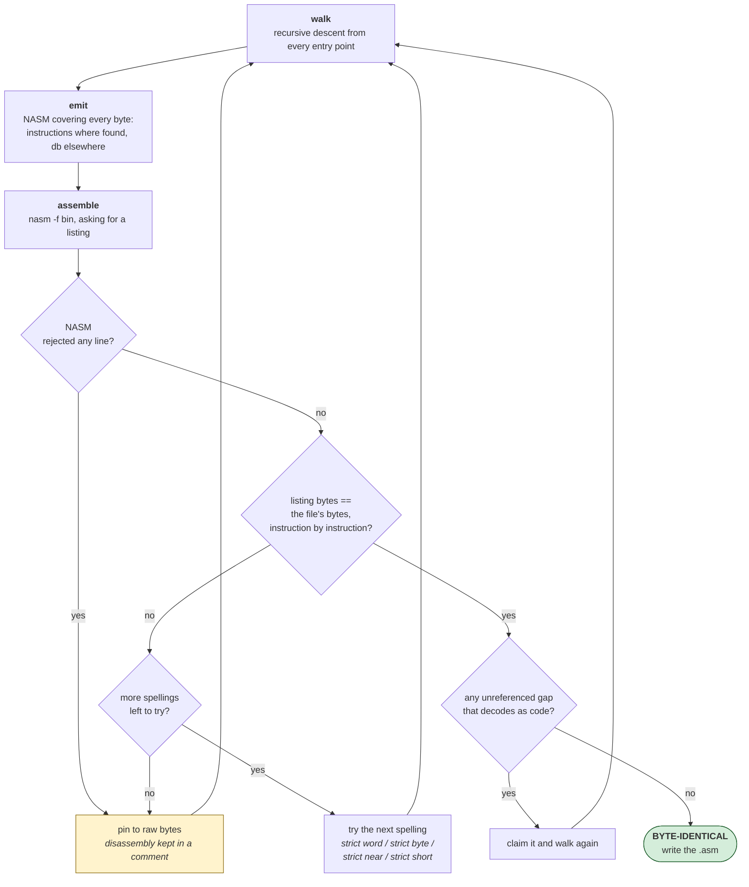
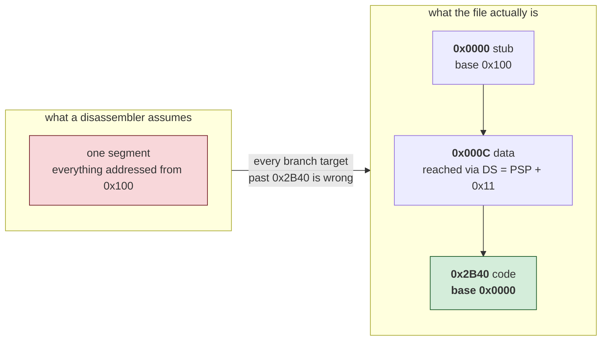

# 08 — Reconstructing a .COM exactly

An MZ executable is decompiled. A `.COM` file can be *reconstructed*: turned
back into assembly that rebuilds the original file byte for byte, with the
rebuild checked rather than assumed. That is rung 1b of the
[verification ladder](../README.md#the-verification-ladder) — the whole image,
not a function at a time — the only rung that leaves nothing to argue about,
and for `.COM` files it is reachable in a single run. A `.COM` gets 1b for
free: there is no linker, so the artefact compared *is* the image, and the
symbol-identity errors that hide from per-function comparison have nowhere to
hide.

The tool is `tools/comrec.py`. The rest of this page is why it works and where
it stops.

## Some MZ executables belong on this route, not the other one

The `.COM` route is described here as the route for `.COM` files, and that was
too narrow. What it actually needs is not a file format but a property:

> **the program is addressed from one base and does not really use segments.**

Plenty of MZ executables have that property. They were written in assembly,
they set `DS` and `SS` once in an entry stub, and the only reason they are MZ
rather than `.COM` is that they are larger than 64 KB of file. For those, the
MZ pipeline is strictly weaker — it reaches "readable, probably right", while
this route reaches a rebuild that is byte-identical and says so.

**Karateka (1984)** is the case that established it. 87,990 bytes, four
relocations, 0.4 stack frames per KB, and an entry stub that reads:

```nasm
    cli
    mov ax, 0x6ca
    mov ds, ax              ; DS = image + 0x6CA0, and that is the last word
    mov ax, 0x155c          ; on the subject of segments
    mov ss, ax
    mov sp, 0x80
    sti
```

Strip the 512-byte header, treat the image as a `.COM` with base 0, take the
entry from `CS:IP`, and it reconstructs:

```
instructions : 10,589 disassembled (987 pinned)
code region  : 0x0000..0x6C9D  (27,805 bytes)
  recovered  : 25,554 bytes as instructions (91.9% of the code region)
BYTE-IDENTICAL
```

The code region the tool found ends at `0x6C9D`. The entry stub sets `DS` to
`image + 0x6CA0`. Those are the same boundary, found twice by different means —
which is the toolkit's own standard for believing a claim.

`comrec.py` now does the stripping itself, so this is one command on the `.EXE`.
It writes the header out beside the source, because **the claim has to be about
the file the user handed over**:

```
nasm -f bin -o image.bin karateka.asm
cat karateka.mzheader image.bin > rebuilt.exe
```

SHA-256 of `rebuilt.exe` equals the shipped `KARATEKA.EXE`, 87,990 bytes.

### When not to

The test is `relocations <= 8`, deliberately narrow, because being wrong here is
silent. A program that really moves between segments will still assemble and
still rebuild exactly; it will simply be wrong about every address, and nothing
will say so.

### A bug worth keeping on the record

The first version of this passed the *path* to the reconstructor and the
stripped image to nothing. So it reconstructed the whole file, header included,
as though the header were code — and it **printed `BYTE-IDENTICAL`**, because it
faithfully rebuilt what it was given.

The output was wrong about every address in the program by 512 bytes, and the
only reason it was caught is that the rebuilt file came out 512 bytes too long.
The fixture's needle is therefore an address, `L_00002`, which can only appear
if the header came off before the walk started.

## Why .COM is the easy case

A `.COM` file has no header. The whole file is the image, DOS loads it at
offset `0x100` of a fresh segment, and execution starts at the first byte.
There are no relocations to apply, no segment table to interpret, no
distinction between what is on disk and what is in memory. Everything an MZ
loader has to reconstruct is simply absent.

That removes almost every source of doubt. What is left is one question asked
repeatedly: is this byte the start of an instruction, or is it data?

## The always-green loop

The tool never emits assembly it has not checked. Each round:

1. Walk the code by recursive descent from the known entry points.
2. Emit NASM source covering every byte — instructions where they were found,
   `db` everywhere else.
3. Assemble it, asking NASM for a *listing*.
4. Compare the bytes NASM emitted for each instruction against the bytes that
   were in the file at that offset.
5. Anything that disagrees is retried with a different spelling, and pinned to
   raw bytes if no spelling works.



The loop ends when the rebuilt file matches the original exactly. It cannot end
any other way, so the output is either right or absent.

Asking NASM for a listing is what makes step 4 possible. Comparing the finished
binary only reveals the *first* byte that differs, and a re-encoding shifts
everything after it, so a whole-file diff cannot name the instruction at fault
— it reports one failure and hides the other two hundred. The listing gives
per-line bytes, which turns "something is wrong somewhere" into an exact list
and collapses hundreds of rounds into a handful.

## Same instruction, different bytes

Most disagreements are not mistakes. An x86 instruction usually has several
legal encodings and NASM picks the shortest; a 1982 assembler often did not.

    05 11 00      add ax, 0x11      accumulator form, what the file holds
    83 C0 11      add ax, 0x11      what NASM emits

Both are correct. Only one matches. `strict word` suppresses NASM's optimiser
and recovers these as readable code — worth 42 instructions of the 223 that
initially failed on ParaTrooper.

Others cannot be recovered as text at all:

    8B D0         mov dx, ax        the file's encoding
    89 C2         mov dx, ax        NASM's, and no syntax selects the other

These differ in the direction bit, and NASM has no way to spell the
alternative. They are emitted as fixed bytes carrying their disassembly in a
comment:

    db 0x8B, 0xD0                          ; mov dx, ax

The reader loses nothing; the byte count does. Judge output by how much of it
is *disassembled*, not by how much is syntactically an instruction.

## Where recursive descent stops, and where it should

Recursive descent follows control flow, so it finds only what something jumps
to. Two failure modes matter, in opposite directions.

**Walking too far.** `mov ax, 0x4C00 / int 0x21` is how every DOS program
exits. Control does not come back, and what usually sits after it is the
message the program just printed. Walk on through and that text becomes
invented code — on a 48-byte test file the string `Hello from a plain COM
file$` disassembled into `insb / outsw / popaw`, which is perfectly valid, byte
identical, and meaningless. The walk stops at a terminating `int`.

**Not walking far enough.** Code reached only through a jump table or a
computed call is never queued, and stays behind as data. ParaTrooper hides
about a kilobyte that way, including a 779-byte block that opens with a plain
`jmp`.

The test for whether an unreferenced gap is code is that linear disassembly
lands *exactly* on its far end. Real code abuts the next known instruction;
arbitrary data almost never decodes into a whole number of instructions
finishing precisely on the boundary. Two guards keep it honest: a gap that is
mostly printable ASCII is left alone, because text decodes into valid
instructions and lands on boundaries just fine, and a gap containing
`insb`, `outsw`, `arpl` or `bound` is rejected, because a game does not use
them.

Every sweep is re-verified by the loop, so a wrong guess costs a round rather
than correctness.

## Indirect jumps: read the pointer's writer, not the jump

The gap sweep recovers code it cannot explain. This recovers code it can.

`jmp word [0xbd9]` ends a walk. Everything the program does afterwards is
invisible, and on a state machine that is nearly everything: **Hard Hat Mack
reaches 236 of its 9,086 instructions from the entry point**, 2.6%, because the
game is entered through exactly one such jump.

That is the "functions reached only through pointers" problem — 28 of Sopwith's
148 entry points, and the one gap the CONTRAP reconstruction independently
reported having no technique for either.

It is not solved in general. But most of it dissolves on one observation: a
state machine of this era does not *compute* the pointer, it stores a constant
into it.

```nasm
    mov word [0xbd9], 0xcb6     ; the game loop
    ...
    jmp word [0xbd9]
```

So the pass is: find every jump or call through a memory word, find every
instruction that writes an immediate to that word, treat those immediates as
entry points, and **iterate** — the code newly reached contains more of both.
Iteration is not optional. Hard Hat Mack's second dispatch variable is only
written by code that the first dispatch reaches.

Measured on Hard Hat Mack, one variable with one target written to it:

| | before | after |
|---|---|---|
| instructions reachable from the entry point | 236 (2.6%) | 8,624 (94.9%) |
| sprite placement calls reachable | 37 of 89 | **85 of 89** |

The rebuild was byte-identical before and after, and the disassembled fraction
barely moved — 9,086 instructions to 9,094. That is the point worth noticing.
The gap sweep had already recovered nearly all of those bytes *as bytes that
decode*; what this adds is knowing they are **reached**, and from where. One is
a guess that survived verification, the other is a fact about the program.

`comrec.py` reports it:

```
dispatch    : jmp [0x0bd9] -> 0x00BB6; jmp [0x6daa] -> 0x02AFC, 0x02B05, 0x02B0E
              indirect jumps resolved from the constants written to the pointer
```

### One character class, nine routines

Worth recording because the failure was silent and the fix was trivial.

Capstone prints a one-digit address **without the `0x`**. A program that keeps
its dispatch pointer low in memory therefore produces

    call word [9]
    mov word [9], 0x1e15

and a detector matching `0x[0-9a-f]+` skips both without a word. Zaxxon keeps
its per-scene wall test at `[9]` — inside its own PSP, which a `.COM` is free
to reuse once it has read the command line — and calls **nine** different
routines through it. All nine sat in the file as data, and nothing in the
output distinguished *there is nothing there* from *the pattern did not match*.

The recursive-descent walk already carried a comment about this exact quirk,
added when a branch to address 8 arrived as `"8"`. The lesson is not about
capstone: **a workaround applied in one place is a bug report about every other
place that parses the same text.** `tests/com/fixtures/dispatch.asm` gained a
third state behind `[9]` so the two address forms are both covered.

**What it will not do** is follow a pointer loaded from a table or arrived at
by arithmetic. Then there is nothing to report and it reports nothing, which is
the correct failure — a guessed entry point sends the disassembler into the
middle of a routine and everything after inherits the error.

The fixture `tests/com/fixtures/dispatch.asm` hides two states behind one
pointer, the second reachable only after the first, with the gap sweep blocked
from rescuing either. Without the pass it recovers 27.9% of the file; with it,
68.9%.

## Jump tables: where to stop is the whole question

The pass above handles a pointer held in a *variable*. The other shape reads
the pointer out of a *table*:

```nasm
    mov bp, word [bx]           ; an index the game keeps
    add bp, 0x75e               ; ... into a table at cs:0x75e
    jmp word [cs:bp]
```

Zaxxon keeps its entire level script this way, and about 2,400 bytes of
routines — 22 scenes and their per-frame handlers — are reachable only through
it and two smaller siblings. Left alone, 57.9% of its code region came back as
instructions; followed, **75.3%**.

Finding the table is easy: the base is an immediate a few instructions above
the jump. Knowing where it ends is the whole problem, and guessing is how a
disassembler walks into artwork. Four bounds, all read from the file:

* **The table is a gap.** Nothing reached it, so it lies in a run of unclaimed
  bytes and cannot extend past the end of that run.
* **A table does not run into the code it points at.** Both of Zaxxon's inner
  tables end exactly where their first forward target begins, with no
  terminator at all.
* **Every entry must disassemble as a routine** — `walks_to_return()`: no
  opcode a game never executes, and an end reached rather than run past. This
  is the bound that does the real work, because it is what separates a table of
  code addresses from a table of *data* pointers. Zaxxon's sprite dispatch is
  the latter: word 0 is a pointer to artwork, the test refuses it, and the scan
  stops with one target and reports nothing. Measured on Zaxxon, all 21
  addresses in its three real tables reach a return; 21 of the 22 artwork
  pointers beside them do not.
* **Nothing beyond the code already found.** One of Zaxxon's four tables opens
  with a word that points 69 bytes past the end of the program's code, into the
  middle of the tile pointer table. It passes every other test — the bytes
  decode, the run reaches a return — and it is not a routine. Slot zero is
  allowed to be junk and nothing else is.

Two of those bounds exist only because of a false positive, and it is worth
being plain that they were added *after* looking at what the tool produced
rather than before. A jump-table follower with three of the four rules
inflated Zaxxon's code region by 287 bytes of tile pointers and reported a
*higher* percentage for doing it.

There is one more interaction worth recording. The gap sweep will happily claim
a jump table as code — a run of code addresses disassembles cleanly and lands
exactly on its far end, which is the entirety of the sweep's test. Two of
Zaxxon's tables had been swallowed that way, so the table pass has to be able
to take a swept run back and let the next round read it properly.

`tests/com/fixtures/jumptable.asm` covers both halves: two routines reachable
only through a table, and a second table whose first word is a data pointer,
which must stop the reader dead. `regress.py` gained a `FORBIDDEN` list for
that second half — a rule with no test for its refusal case is only half
tested, and the half that costs nothing to get wrong is the one that ships a
confident wrong answer.

## The trap: a .COM with two bases

A `.COM` is nominally one segment, but anything larger than a few kilobytes
often opens with a stub that reloads CS and continues at a fresh base.
ParaTrooper's first twelve bytes are:

    mov ax, cs
    add ax, 0x2C4
    push ax
    xor ax, ax
    push ax
    mov ax, ds
    retf

That is a far return to `(CS+0x2C4):0` — file offset `0x2B40`, addressed from
base 0 rather than 0x100:



Miss it and everything after `0x2B40` disassembles against the wrong base.
Every branch target is wrong, the recursive descent walks off into data, and
the reconstruction fails in a way that gives no hint of the cause. It is also
the single fact a newcomer to the file is least likely to guess, which is why
`comrec.py` works it out from the entry stub instead of asking. Pass
`--segment OFF:BASE` if a program does something stranger.

Note the `mov ax, ds` before the `retf`. It is easy to skim past, and it
decides what `AX` holds when the real code starts — which in turn decides
where `DS` ends up, and therefore what every data reference in the program
means.

### And the stub is not always at offset 0

ParaTrooper's stub is the first thing in its file, so abstract-evaluating from
byte 0 walks straight into it. Zaxxon (1984) does not oblige:

    0x0000  jmp 0x180
    0x0002  "Zaxxon is brought to you by :" ... 0x1A
    0x0080  mov ax, cs / add ax, 0x20 / push ax / ... / retf

The banner is a crack group's signature, written so that `TYPE ZAXXON.COM`
prints it and stops at the DOS end-of-file byte. Between it and offset 0 is one
`jmp`, and `detect_layout()` treated a jump as the end of the stub and gave up.

The result is the clearest illustration in this repository of why byte-identity
is not understanding:

    instructions: 9 disassembled
    bytes as code: 18 / 20,736  (0.1% of file)
    BYTE-IDENTICAL

Nine instructions. The rebuild was exact because 20,736 bytes were copied.
Following a direct jump before evaluating — bounded, and refusing to revisit an
address — costs four lines and takes Zaxxon from 9 instructions to 2,089 with
no flags at all. `tests/com/fixtures/jmpstub.asm` reproduces the shape.

## Making the data readable

Byte-identity is the whole claim, but a file that is two-thirds data is not
much use as a wall of hex. Two things make it navigable.

**Strings.** A printable run of eight bytes or more is emitted as text. NASM
assembles the quoted form to exactly the same bytes, so nothing is risked:

    db 'Do you have the Color/Graphics'                    ; 0x01A08  ds:0x19F8

Find the start of the run *before* emitting the hex around it. Emitting a fixed
sixteen bytes first slices the front off every string — `Greg Kuperberg`
arrives as `uperberg` with the rest buried in the row above.

**Two addresses per row.** Code reaches data through `DS`, which is rarely
where the file begins. ParaTrooper sets `DS = PSP + 0x11`, so `mov si, 0x19F6`
in the code and the bytes at file offset `0x1A06` are the same string. Without
both numbers on the line there is nothing connecting them. `comrec.py` reads
the `add ax, imm / mov ds, ax` idiom at the start of the code and annotates
every data row with both.

## Entry points the hardware calls

Recursive descent finds what the program branches to. An **interrupt handler**
is reached by neither branch nor call: the hardware jumps to it. So a game that
takes over the keyboard or the timer hides a whole routine from the walk, and
the disassembler records it as data without complaint.

The install is readable. The vector table is at absolute address 0, so the
program points a segment register at zero and writes a far pointer into slot
`vector * 4`:

```nasm
    xor ax, ax
    mov es, ax                  ; ES -> the vector table
    lea ax, [0x171]             ; handler offset
    mov bx, cs                  ;   and segment
    xchg word [es:0x24], ax     ; 0x24 / 4 = vector 9, the keyboard
    xchg word [es:0x26], bx
```

`xchg` rather than `mov` because the program wants the old vector back, to chain
to or to restore on exit — so an `xchg` against a low, four-byte-aligned `es:`
offset is itself a good signal.

`comrec.py` reads this and adds the handler as an entry point, reporting:

```
interrupts  : INT 09h -> file 0x00071
```

**Hard Hat Mack's handler was recovered before this existed** — but by the gap
sweep, which accepted it because its bytes happened to decode cleanly and land
exactly on the boundary. That is luck. A handler containing one
implausible-looking opcode, or sitting in a gap that does not end where it does,
would have been lost silently. `tests/com/fixtures/interrupt.asm` is built so
the sweep *cannot* rescue it, which is what makes the test meaningful.

### The same install with no `es:` in it

Reading only the absolute form is not enough. Zaxxon writes the slot through a
base register instead:

```nasm
    mov ax, cs
    lea dx, [0x191]             ; handler offset
    xor cx, cx
    mov ds, cx                  ; DS -> the vector table
    mov bx, 0x70                ; 0x70 / 4 = vector 0x1C, the timer
    mov word [bx], dx
    mov word [bx + 2], ax
```

There is no `es:` anywhere in it and no constant that looks like a vector slot.
Matching the absolute form alone found nothing, and the whole 47-byte timer
handler stayed in the file as data — and with it every conclusion about how the
game keeps time. The detector now tracks which segment register was zeroed and
what constant a base register holds; `tests/com/fixtures/timer.asm` covers it.

## Provenance: was this written, or generated?

Before asking why code is shaped a certain way, establish what shaped it. A
tool's output follows the tool's rules, and those rules show up as a pattern
repeated far more often than any person would repeat it.

Hard Hat Mack contains **391 `cmc` instructions**. `cmc` complements the carry
flag; most programs contain none. Counted across the whole disassembly:

| | |
|---|---|
| directly after a `cmp` or `sub` | **99%** |
| share of all compares followed by one | **91%** |
| followed within 3 instructions by anything reading carry | 37% |

`CMP` and `SUB` set carry to record a borrow, and the 6502 and the 8088 define
it in opposite directions: on the 6502 carry is set when there is *no* borrow.
Code moved from one to the other must flip the carry after every compare, or
every dependent branch inverts.

So a carry-flip after 91% of compares, most of them never read, is not a style.
It is an **adapter emitted unconditionally by a translator** — the IBM version
was mechanically converted from the Apple II 6502 source, not rewritten. The
63% that are dead are the proof: a person flips the carry where it matters.

`comrec.py` reports this and stays silent on hand-written x86:

```
provenance  : mechanically translated from 6502
              391 cmc, 99% of them straight after a cmp/sub, covering 91% of
              all compares -- a carry-convention adapter, not hand-written x86
```

It matters for reading. The structure is the 6502 program's, short routines and
memory-heavy code reflect a processor with almost no registers, and odd
sequences are artefacts rather than intent.

## Looking at the data

A reconstruction can be byte-perfect and still be misunderstood. `comrec.py`
proves the *source* is right. It says nothing about whether the region you have
labelled "sprites" is sprites, and a wrong answer there is expensive: a port
built on it fails only after the artwork goes on screen.

`tools/gfxdump.py` is the cheap check. Decode the bytes as CGA pixels, write a
PNG, and look. Shapes mean the region and the format are both right; noise
means one of them is wrong, and you know within a minute.

Two things make it work in practice.

**Byte histograms identify artwork before anything is decoded.** A region whose
commonest values are `0xAA`, `0x55`, `0xFF` and `0xF0` is almost certainly
graphics: in CGA's two-bits-per-pixel format those are solid runs of one
colour, which is what sprites are mostly made of.

**Wrong widths shear the picture diagonally**, unmistakably, so `--sheet`
renders the same bytes at several widths and lets the eye pick. Better still,
some games store the size in the data -- Hard Hat Mack writes
`[width_bytes, height_rows]` ahead of every sprite, which is why its pointer
table steps by 66 for a 4x16 and 34 for a 4x8. `--self-sized` reads that.

**Expect the wrong orientation, and settle it with text.** Sprites are stored
in whatever order the drawing routine walks them, which need not be top-left
first. Hard Hat Mack stores them **bottom row first**, because its blitter
steps down a table of scanline addresses while reading the sprite forwards.

This is a trap because the wrong orientation still produces plausible shapes,
so you stop checking. Its Electronic Arts logo was first read as *horizontally
mirrored* — at small scale a vertically flipped E-L-C-T-O-I-A-R-S is symmetric
enough to seem to read backwards. Rendering all four orientations settled it in
seconds. If a sheet contains any text, orient by the text: text has one correct
orientation, shapes have four that all look fine. `--flip-v` and `--mirror`.

## A measurement that does not work — and the conclusion drawn from it, which was wrong

This section used to end here, and the ending was wrong. Both halves are kept,
because the mistake is more instructive than the fix.

Pins look stale. Each is decided in one round against a program that later
rounds change — the sweep turns data into code, labels appear where a `db` run
used to be. The obvious improvement is to release them all once the structure
settles and keep only those that still fail.

It was implemented, measured, and removed.

Releasing every pin on Hard Hat Mack produces a rebuild **two bytes shorter**,
because `and ax, 0x2324` sits in the file as the 4-byte ModR/M form while NASM
emits the 3-byte accumulator form. Every displacement after each shrink is then
wrong, so 337 `call` instructions report a mismatch they had nothing to do with
— and the measurement says 691 instructions are mis-encoded when the truth is
646.

That measurement is real and it is still true. **The conclusion drawn from it —
"pins cannot be evaluated in bulk" — did not follow.**

Only a *length* change shifts the instructions after it. A pin whose released
spelling assembles to the same number of bytes cannot move anything. So the
answer is not to judge everything in one round; it is to put the
length-changers back first and judge the rest in the round after that, when
nothing has shifted. Two extra rounds, and the always-green loop re-proves
byte-identity at the end exactly as before.

| | pins before | pins after | still byte-identical |
|---|---|---|---|
| ParaTrooper | 236 | 178 | yes |
| Zaxxon | 138 | 90 | yes |
| Hard Hat Mack | 649 | 320 | yes |

Half the pins in Hard Hat Mack were never mis-encoded at all; they were
instructions demoted in an early round as collateral damage from one that was.
Zaxxon pinned 41 plain `call` instructions that assemble to the original bytes
on the first try.

The lesson is not about pins. **A measurement that is sound can support a
conclusion that is not**, and the way that happens is by mistaking "this
number is meaningless" for "this cannot be measured". The first is a fact about
one experiment; the second is a claim about every possible experiment, and it
is much larger than the evidence.

C. ParaTrooper has no stack-frame prologues anywhere — it was written in
assembly, so there is no C source to recover and no amount of work will produce
any. What comes back is assembly that rebuilds the original exactly, which is a
stronger guarantee than "it recompiles" but a different thing from the C the
MZ pipeline aims at. See [00-scope.md](00-scope.md).

Check for prologues before promising anyone C.

## Measured

Three games, all with no manual flags, all byte-identical with SHA-256 verified
independently of the tool:

| | ParaTrooper (1982) | Zaxxon (1984) | Hard Hat Mack (1983) |
|---|---|---|---|
| file size | 16,400 | 20,736 | 42,112 |
| instructions disassembled | 2,017 | 2,655 | 9,060 |
| pinned to fixed bytes | 178 | 116 | 320 |
| code region | `0x2B40..0x4010` | `0x0000..0x20DD` | `0x0000..0x6C8B` |
| recovered, of that region | **90.9%** | **75.8%** | **78.2%** |
| of the whole file | 29.6% | 30.8% | 51.6% |

The whole-file figures are the wrong ones to quote. Two thirds of ParaTrooper
is a screen-offset table and sprite data; 60% of Zaxxon is artwork. A
percentage of the whole file measures the game, not the recovery — which is why
the tool now trims a large data block from *either* end of the file rather than
only from the front, and reports both numbers.

Zaxxon needed four separate fixes to get there, and the sequence is the point:
0.1% of the code region → 57.9% once the entry stub behind the banner was
found → 75.3% once the jump tables were followed → 75.8% once a one-digit
dispatch address stopped being skipped. Every one of those figures sat
alongside `BYTE-IDENTICAL`.

Zaxxon's remainder is also fully accounted for, which is the check worth
copying: every data run of eight bytes or more was matched to an instruction
naming an address inside it, leaving **zero unexplained** — a banner and two
runs of alignment zeros are the only bytes nothing points at. "Not recovered as
instructions" and "not explained" are different claims, and only the first was
ever true.

Regression fixtures live in `tests/com/`. They are written rather than taken
from a real game, because games from the period are still under copyright.

## A rebuild is not a reading, and naming must not change it

`comrec` finishing is the end of one job and the start of another. Karateka's
listing is byte-identical and 99.1% of its code region carries an instruction,
and it is still ten thousand lines of `L_02605` and `word [0x116]`. **38 of its
120 routines are named — 32%.** Quote both numbers or the first will be read as
the second.

`annotate.py` closes the gap without weakening the claim. It takes a symbol
file — `{address: [name, why]}` — and applies it as `%define`s and label
renames only, so NASM emits exactly the bytes it emitted before the names
existed, and then rebuilds and compares to prove it:

```
38 routine names, 44 globals
  applied: 157 label references, 569 memory references
BYTE-IDENTICAL after naming. SHA-256 c8736bba...
```

Two rules earned the hard way:

**Rename globals only inside brackets.** `mov ax, 0x116` is the constant 278,
not `player_health`. Rewriting it produces source that still assembles and is
no longer true, which is the worst of both.

**Every name carries its evidence.** The `why` field is not decoration. Three
names in this project were published without one and had to be withdrawn --
"the joystick routine", "hand-written assembly", "health counters" -- and each
had been believed in the meantime because it was written down. A name is a
claim; store the reason beside it or do not store the name.

The symbol file belongs to the game and the tool belongs here. The *output*
belongs nowhere: a byte-identical reconstruction is the program, named or not.
