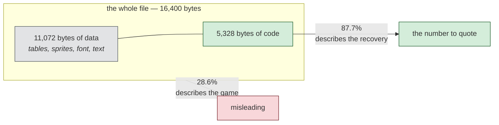

# Case study — ParaTrooper (1982), rebuilt byte-for-byte

A test of the method against a game nobody here had seen before, chosen
because it is small: 16,400 bytes, a single `.COM` file, published by Orion
Software in 1982 and written by Greg Kuperberg.

The goal was source that recompiles. What it produced is stronger — source
that reassembles to a file identical to the original, checked by SHA-256
outside the tool that generated it.

The binary is not in this repository; it is still under copyright. The
regression fixtures in `fixtures/` reproduce the patterns it exposed.

## Result

```
python tools/comrec.py ParaTrooper.1982.com --out src/paratrooper.asm
```

No flags. The tool works out the rest.

```
segments    : 0x0000+ @ base 0x0100, 0x2B40+ @ base 0x0000   (detected from the entry stub)
instructions: 2,017 disassembled (236 pinned to fixed bytes to preserve encoding)
bytes as code: 4,686 / 16,400  (28.6% of file)
code region : 0x2B40..0x4010  (5,328 bytes)
  recovered : 4,674 bytes as instructions (87.7% of the code region)
  data head : 0x0000..0x2B40 left as data (11,072 bytes)

BYTE-IDENTICAL
```

Verified independently:

```
nasm -f bin -o rebuilt.com src/paratrooper.asm
# SHA-256 D709DDEC...09342 for both files, 16,400 bytes each
```

## Read the second number, not the first

28.6% of the file came back as code. That figure describes the game, not the
recovery: two thirds of ParaTrooper is lookup tables, sprite data, a digit
font and text. The first table gives its shape away immediately — `0x2A, 0x92,
0xFA, 0x162, 0x1CA, 0x232`, a constant stride of 104 bytes — though what reads
it was never found, so what it indexes remains a guess.

Within the region that actually holds code, 87.7% came back as instructions.
That is the number worth quoting, and the tool now prints both so the
distinction cannot be lost by accident.



## What the program turned out to be

Hand-written assembly. Not one stack-frame prologue in 16 KB, which settles the
question of what can be recovered before any work is done: there is no C source
behind this file, so no decompiler will produce any. Saying so early is more
useful than producing plausible C that never existed.

The opening code reads the BIOS equipment word at `0040:0010`, masks the video
bits, and if it finds a monochrome adapter prints

    Sorry, Paratrooper does not work
    on the Monchrome Display Adapter.  You
    must have a Color/Graphics Monitor
    Adapter in order to play this game.

and then executes `74 FE` — `je $`, a deliberate hang. (The typo is the
original's.) Otherwise it asks *Do you have the Color/Graphics Monitor
Adapter(Y/N)?* and reads a key.

## The trap

The first twelve bytes are:

    mov ax, cs
    add ax, 0x2C4
    push ax
    xor ax, ax
    push ax
    mov ax, ds
    retf

A far return to `(CS+0x2C4):0` — file offset `0x2B40`, addressed from base 0
instead of 0x100. Every branch target after that offset is wrong if the split
is missed, and the failure gives no hint of its cause: the disassembly simply
walks off into data and the rebuild fails somewhere unrelated.

The `mov ax, ds` on the second-to-last line is easy to skim past and decides
everything downstream. It leaves `AX` holding the PSP segment, so the
`add ax, 0x11 / mov ds, ax` that opens the real code puts `DS` 0x110 bytes into
the file. That is what connects `mov si, 0x19F6` in the code to the prompt
string at file offset `0x1A06`. Two independent references confirmed the bias
before it was trusted.

Both are now detected automatically. Neither was, at first.

## Five bugs this found

The attempt was worth more for what it broke than for what it produced.

**Data emitted out of order.** Bytes of an instruction that had been pinned
were buffered and flushed at the *next* label — so they landed after the code
that followed them, and the file shifted. The symptom was maddening: every
instruction matched its original encoding, and the file still differed at
`0x2B40`. Buffered data now goes out before any instruction is written.

**Encoding alternates treated as errors.** 223 instructions were demoted to raw
bytes for differing from NASM's preferred encoding. Most differ only in form —
`05 11 00` against `83 C0 11`, both `add ax, 0x11`. Retrying with `strict word`
recovered 42 of them as readable code. The rest differ in the direction bit
(`8B D0` against `89 C2`), which NASM has no syntax to select; they are now
pinned as bytes carrying their disassembly in a comment.

**The walk ran past the exit.** Nothing stopped recursive descent at
`mov ax, 0x4C00 / int 0x21`, so it disassembled whatever followed. On a 48-byte
test file the string `Hello from a plain COM file$` became `insb / outsw /
popaw` — valid, byte-identical, and nonsense. Caught by a fixture, not by the
game.

**Branch targets below 0x10 lost their labels.** Capstone prints a jump to
address 8 as `8`, not `0x8`, and the code only accepted operands beginning
`0x`. Those branches silently became bare numbers pointing nowhere. Also caught
by a fixture — ParaTrooper has no code at such a low address and would never
have revealed it.

**32-bit mnemonics in 16-bit mode.** Capstone reports the single byte `0x98` as
`cwde`, its 32-bit name, even when told the mode is 16-bit — in real mode it is
`cbw`. NASM assembles `cwde` as `66 98`, two bytes, so verification failed and
those instructions were pinned. The rebuild stayed correct, which is why this
survived so long: the only visible symptom was nine instructions written as
bytes with a comment naming the wrong instruction. Trusting the encoding over
the name fixed both.

The last three are the argument for testing against something other than the
target. Two were caught by written fixtures; the third was caught by trying to
quote a routine accurately in prose, which turns out to be its own kind of
test — writing documentation forces you to read output you would otherwise only
run.

## What changed in the toolkit

- `tools/comrec.py` — the reconstructor, with the always-green loop
- `tools/triage.py` — routes `.COM` files here instead of refusing them
- `knowledge/08-com-reconstruction.md` — the method and its limits
- `tests/com/` — eight fixtures, each rebuilt byte-identically on every run

The fixture set grew as later games broke things this one did not reach. In
order of when each was written:

| fixture | what it pins down | the game that exposed it |
|---|---|---|
| `plain.asm` | the walk stops at the DOS exit; strings print as text | ParaTrooper |
| `farstub.asm` | a `retf` stub splitting the file into two address bases | ParaTrooper |
| `encodings.asm` | `strict word` recovers an encoding alternate; the rest pin | ParaTrooper |
| `interrupt.asm` | a handler found by reading `xchg word [es:0x24], ax` | Hard Hat Mack |
| `dispatch.asm` | `jmp word [var]`, resolved from who writes the pointer | Hard Hat Mack |
| `jmpstub.asm` | the stub is behind a `jmp` over a text banner | Zaxxon |
| `timer.asm` | the same vector install with no `es:` in it | Zaxxon |
| `jumptable.asm` | routines reached through a table — and a decoy that must be refused | Zaxxon |

`jumptable.asm` is the first fixture whose point is partly an **absence**: its
second table holds a data pointer, and `regress.py` fails if the routine behind
it comes back as code. A rule with no test for its refusal case is only half
tested, and the untested half is the one that ships a confident wrong answer.
